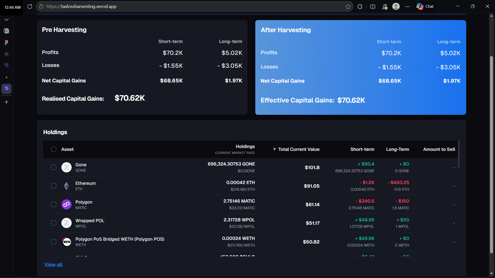
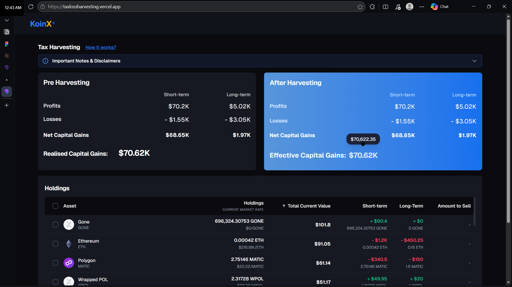

# Tax Loss Harvesting Calculator

A modern, responsive React web application that helps investors simulate and calculate tax savings through tax-loss harvesting. The application allows users to dynamically select from their holdings to visualize the offsets against their realized short-term and long-term capital gains.

## Features
- **Real-Time Offset Simulation**: Select losing assets to instantly calculate net total savings across multiple tax buckets.
- **Dynamic Formatting**: Compact formatting handles million-dollar figures cleanly, while exact decimals are accessible via hover tooltips everywhere on the dashboard.
- **Premium UI**: Built with a sleek dark-mode aesthetic utilizing Tailwind CSS, Lucide icons, and Shadcn UI tooltips/collapsibles.
- **Detailed Interactive Data**: A fully sortable holdings table featuring ascending/descending logic configured directly into customizable React hooks.

## Screenshots


> **Dashboard Overview**
> 

> **Tooltip Formatting Interactions**
> 

## Setup Instructions

### Prerequisites
- [Node.js](https://nodejs.org/) (v16 or higher recommended)
- `npm` or `yarn`

### Installation

1. **Navigate to the project directory**:
   ```bash
   cd TaxLossHarvesting
   ```

2. **Install dependencies**:
   ```bash
   npm install
   ```

3. **Run the local development server**:
   ```bash
   npm run dev
   ```
   The application will boot up at `http://localhost:5173/` by default.

4. **Build for production**:
   ```bash
   npm run build
   ```

## Assumptions

1. **Mock Data Integration**: All user balances, historical coin prices, and existing capital gains are pulled from localized, simulated files (`src/lib/mock-api.ts`). In a production scenario, these would bind straight to backend server endpoints.
2. **Tax Jurisdictions**: The algorithms inherently organize and evaluate metrics across generic "Short-term" and "Long-term" categories. It assumes these buckets offset linearly within themselves. As noted in the disclaimer, tax-loss harvesting logic differs widely country-by-country (e.g., wash-sale rules).
3. **State Volatility**: The application functions statelessly per-session. Refreshing the browser will automatically wipe selected rows and repopulate them against the default fetch queries, as it does not rely on local browser storage/cache systems currently.
4. **Currency Default**: The UI formatter specifically enforces USD (`$`) conventions globally for ease of display.
